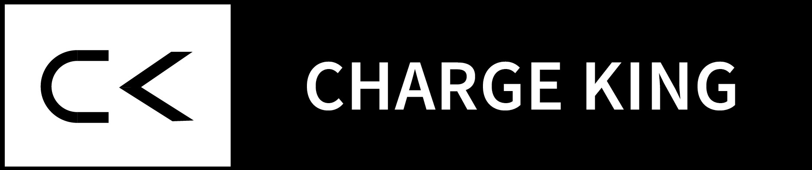
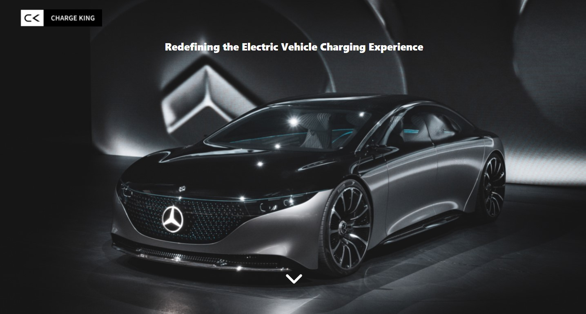

<!--  -->
<h1 align="center"></h1>
<!-- <h1 align="center">Charge King</h1> -->
<h3 align="center">Redefining the Electric Vehicle Charging Experience</h3>

<br/>

<!-- <br/> -->

## 🎯 About

I have started this project with the purpose of developing a Web app for the Charge King - a company providing charge stations to the nearest available location. <br/>
I put a lot of effort into it and I hope that you could like it.<br/><br/>
The Web App lands you to a Home page, in which you can know about the company along with their founders. And, also the user can contact the company for any issues or enquires.<br/>
The user can also subscribe to the company's newsletters by sharing their email id's to them.<br/>
➡️ Go try it and please let me know if you enjoyed it with a ⭐️, I would appreciate it a lot.
<br/>
<br/>

## ▶️ Demo

Here you can find the demo link:

[https://charge-king.netlify.app/](https://charge-king.netlify.app/)

## 🚀 Technologies

- [React](https://reactjs.org/)
- [Material-UI Icons](https://material-ui.com/)
  <br/>

# 📸 Screenshots


<br/>

## ✅ Requirements

Before starting you need to have [Git](https://git-scm.com) and [Node](https://nodejs.org/en/) installed.

<br/>

## 🔗 Run Locally

- Clone the project

```bash
  git clone https://github.com/shivendradb/Charge-King-ReactJS.git
```

- Go to the project directory

```bash
  cd LinkedIn-clone
```

- Install dependencies

```bash
  npm install
```

- Start the server

```bash
  npm start
```

Note: <br/>
The page will reload if you make edits. <br/>
You will also see any lint errors in the console.

You can **contact me** in case of any issues or discrepancies. <br/>

#### **Please let me know if you enjoyed it with a ⭐️, I would appreciate it a lot.**
